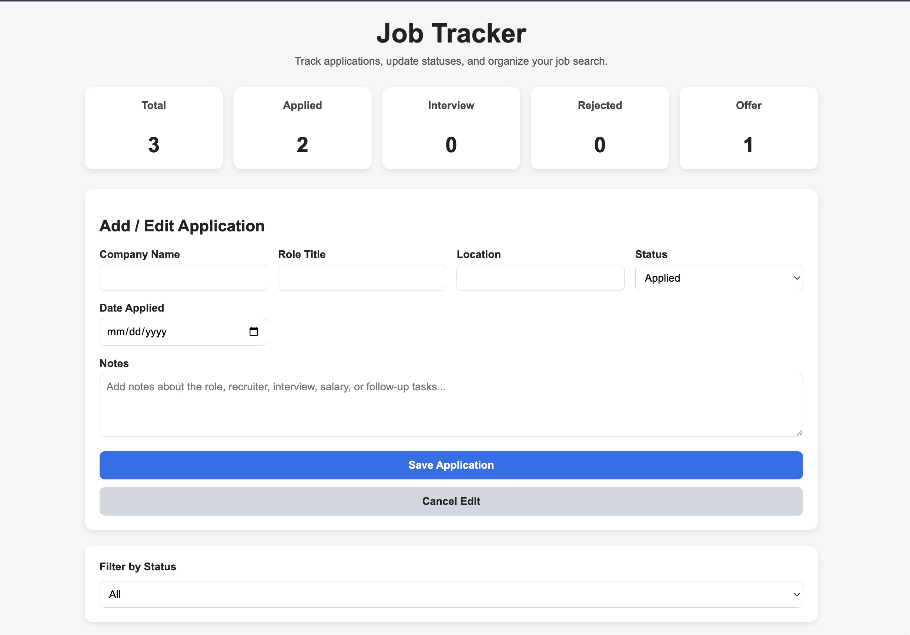
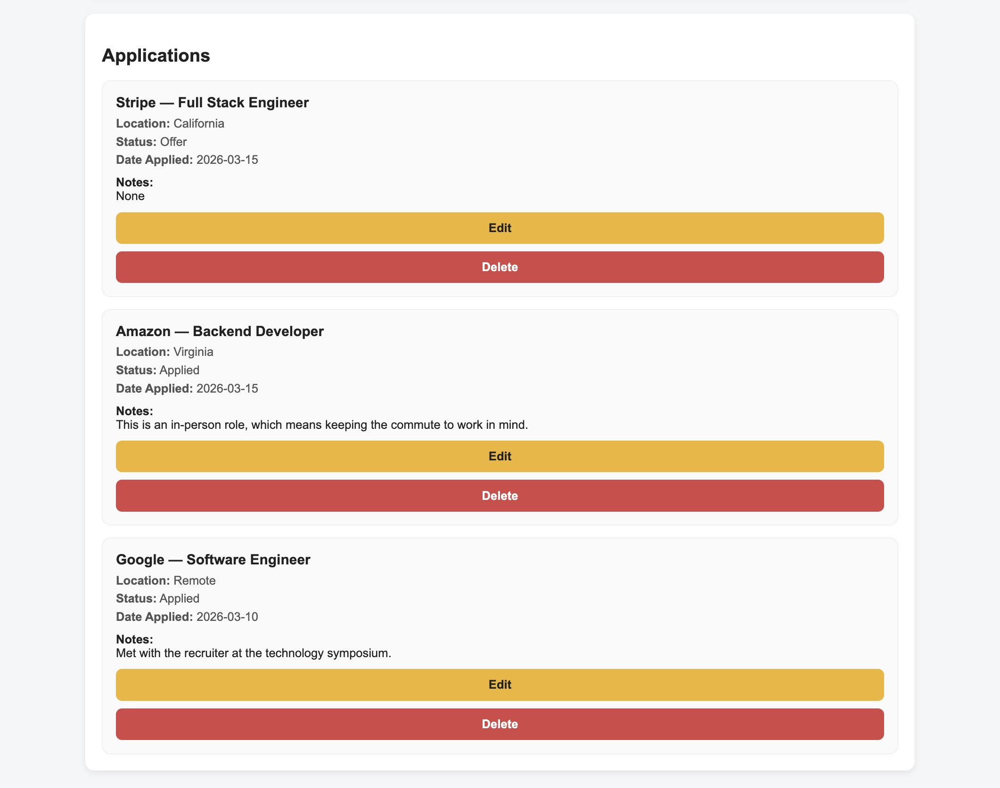

# Job Tracker

A simple web application for tracking job applications during the job search process.

Users can add, edit, delete, and filter job applications while tracking their progress through different stages such as Applied, Interview, Rejected, or Offer.

The application stores all data locally in the browser using `localStorage`, so application entries persist even after refreshing the page.

---

## Screenshots

### Dashboard



### Applications List



---

## Features

- Add job applications
- Edit existing applications
- Delete applications
- Track job status
- Filter applications by status
- Dashboard summary of applications
- Persistent data using localStorage

---

## Dashboard

The dashboard displays counts for:

- Total applications
- Applied
- Interview
- Rejected
- Offer

This provides a quick overview of the current job search progress.

---

## Live Demo
Play the games here:

https://antonioc-26.github.io/Job-Tracker/

---

## Technologies Used

- HTML5
- CSS3
- JavaScript
- localStorage API

---

## Status Types

- Applied
- Interview
- Rejected
- Offer

---

## First Time Setup

Follow these steps to run the project locally.

### 1. Clone the Repository
    git clone https://github.com/antonioc-26/Job-Tracker.git
    cd job-tracker

Or download the ZIP from GitHub and extract it.

--- 

### 2. Open the Project in VS Code

Open **Visual Studio Code** and select:

File → Open Folder → job-tracker

## Running the Project (Recommended)
### Using VS Code Live Server

This is the easiest way to run the project locally.

### Step 1: Install the Live Server Extension

1. Open **VS Code**
2. Click the **Extensions** icon
3. Search for: "Live Server"

4. Install **Live Server (by Ritwick Dey)**

---

### Step 2: Start the Server

Right click the file:

    index.html

Select:
    
    Open With Live Server

Your browser will automatically open something similar to:

    http://127.0.0.1:5500/index.html

---

### Live Reload

When you edit and save any file such as:

    CSS
    JavaScript
    HTML

The browser will automatically refresh.

---

## Project Structure
```
job-tracker/
├── LICENSE
├── README.md
├── index.html
├── script.js
└── style.css
```

---

## Development

If you plan to modify or add games:

1. Run the project using Live Server
2. Edit HTML/CSS/JavaScript files
3. Test changes in the browser with auto-refresh

---

## Contributing

Contributions are welcome.

If you'd like to improve the project:

1. Fork the repository
2. Create a feature branch
3. Commit your changes
4. Open a pull request

---

## License

This project is open source and available under the **MIT License**.

---

## Author

Developed by: Antonio Corona Montes De Oca  
GitHub: https://github.com/antonioc-26
